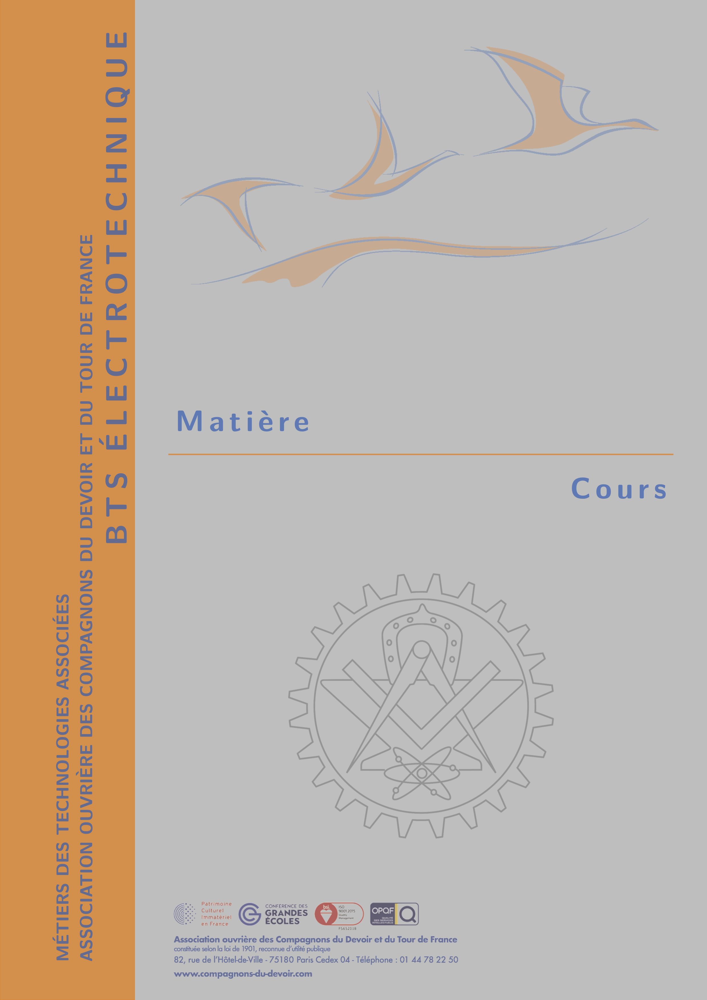
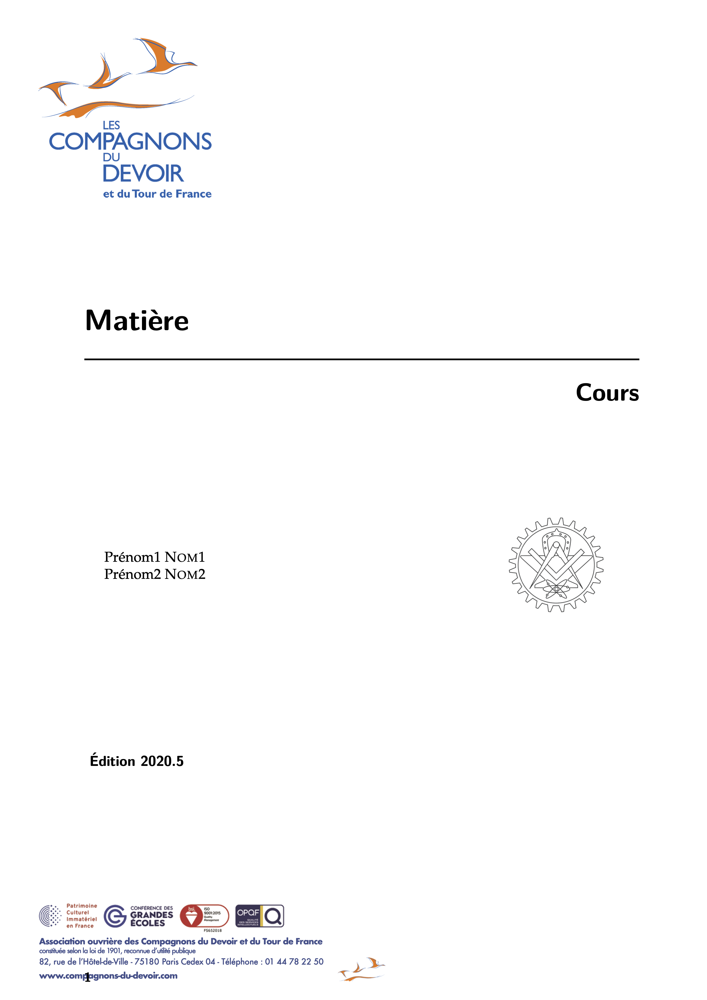
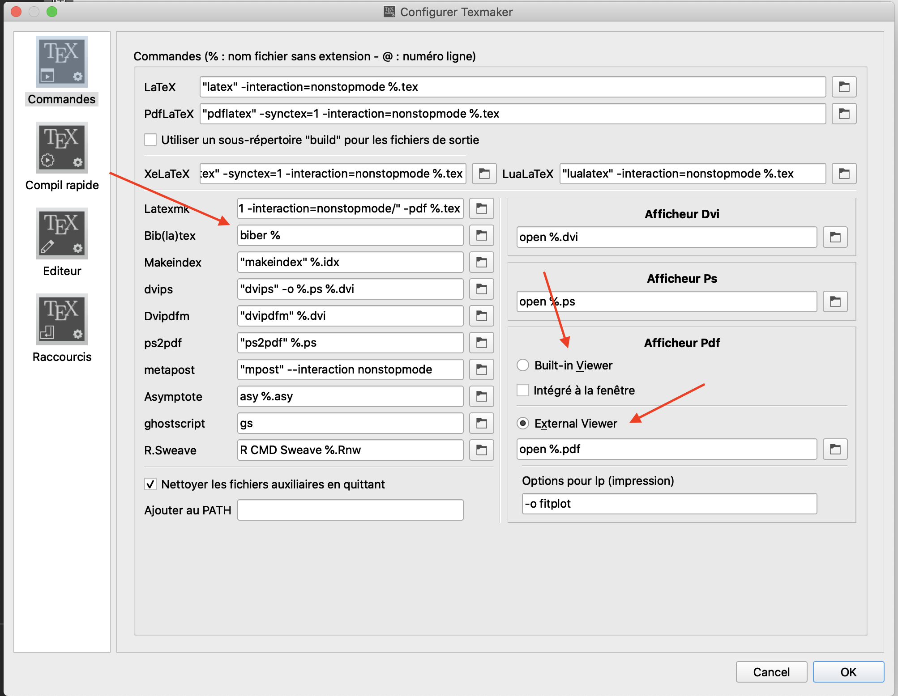
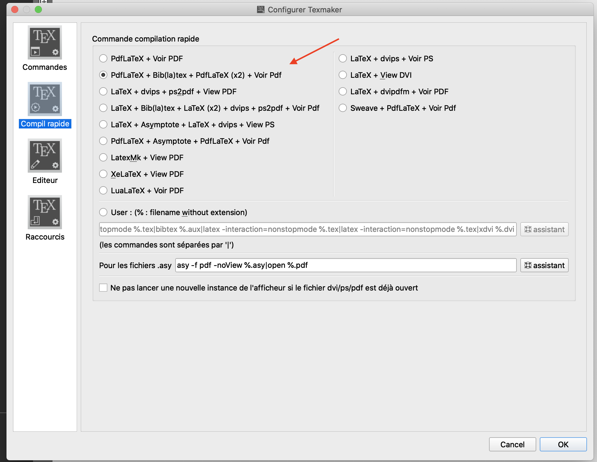
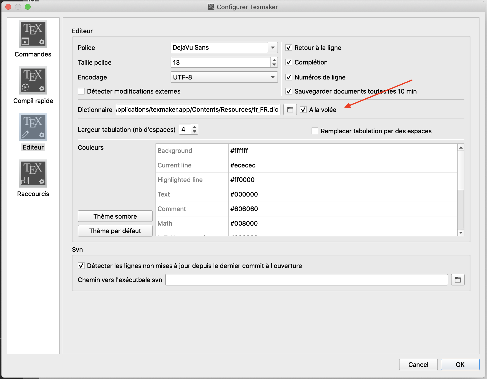

# ElectroTeXnique 
 
**Clean** LaTeX template for educational content for highly qualified craftsmen in electrical engineering

## Pour commencer

Canevas de rédaction et support de cours destiné au (gros) chantier de création de contenus pédagogiques pour les formations en électrotechnique octroyées à l'AOCDTF. Des directives de rédactions seront ajoutées au fur et à mesure de l'avancement du projet, pour standariser les productions au mieux et permettre de produire des documents de qualités.
**Pour respecter au mieux la charte graphique, prendre le temps de bien décrypter les instructions ci-dessous est indispensable.**


| Page de couverture  | Page de titre | Page de titre du diaporama |
| :------------------: | :------------------: | :------------------: |
|  |  | |

## Pré-requis

0. Maitriser les bases de la programmation sous l'environnement LaTeX. Pour cela, prendre le temps de décrypter les codes **commenté avec soin** des cours de pré-requis en physique-chimie `matieres/physique-chimie/pre-requis` et schéma de liaison à la terre en électrotechnique `matieres/electrotechnique/schema_liaison_terre` est nécessaire. 
Divers documents de tutoriel pour tous les niveaux sont disponibles dans la base de données, avec entre autre : 
    - `base_de_donnees/latex/masson-fiches_latex/...`
    - `base_de_donnees/latex/goulet-redaction_latex.pdf`
    
1. Installer 
 	- LaTeX avec la distribution [TexLive](https://www.tug.org/texlive/)
 	- Editeur [Texmaker](https://www.xm1math.net/texmaker/index_fr.html)
 	- Programme de gestion des bibliographie [Biber](http://biblatex-biber.sourceforge.net)
 	- Editeur d'image en format vectoriel [Inkscape](https://inkscape.org/fr/)
 	- Extracteur de données issues de graphiques [WebPlotDigitzer](https://automeris.io/WebPlotDigitizer/)
 	- Logiciel de géométrie [Geogebra](https://www.geogebra.org/?lang=fr)
 	- S'inscrire sur le site d'éditeur de dessin Tikz (code de dessin LaTeX) [Mathcha](https://www.mathcha.io/editor)

2. Bien paramétrer l'éditeur Texmaker :

<p float="left">
  
   
  
</p>

3. Cloner le dépôt BTS-ElectroTeXnique à l'aide de l'application Github Desktop au préalablement installée, importer le dépôt et créer une nouvelle branche nommée "Branche-votrenom".

4. Ajouter le package "AOCDTF" et les autres packages du dossier `/BTS-ElectroTeXnique/parametres/packages_manquants` dans le dossier contenant les packages `texlive/2020/texmf-dist/tex/latex` avec les docs correspondantes, se référer au tutoriel présent dans le même dossier "tutoriel_ajout_packages.pdf" (ne pas oublier de rafraichir la database).

## Initialisation de la programmation d'un nouveau cours

1. Copier/coller le dossier `/parametres/canevas` pour créer un nouveau cours dans les dossiers /matieres/cours/... en renommant le dossier au nom du cours (matiere > cours > chapitre > sous-chapitre...).


2. Ne pas renommer les fichiers copiés pour le nouveau cours mais indiquer en tête de chaque programmation pour repérer facilement le nouveaux cours :

``` bash
%--------------------------------------
%INTITULE DU COURS 
%--------------------------------------
```

3. Ajouter les informations relatives au cours en question dans les page de titre, couverture et autres informations.

4. **Rectifier l'arborescence des fichiers.bib (en s'aide du fichier `INDICATEUR_ARBORESCENCE.tex`) car celle du canevas n'est pas la même que celle pour les cours !**

5. Si des modifications sont à ajouter au package AOCDTF ou au canevas, **consulter** l'équipe pour qu'on exporter ajouter ces modifications.

## Rédaction de la programmation d'un nouveau cours

1. Utiliser la programmation "document_maitre" seulement pour accueillir les appels de sous-programmation (chapitres, préambules, sous-programmation de mise en page...).

2. Pour la rédaction de nouveaux chapitres ou de figure/tableaux complexes, créer une sous-programmation :
    - en exécutant `fichier -> nouveau à partir d'un document existant` et sélectionner `MWE.tex` (Minimal Work Environnement);
    - en enregistrant la sous-programmation dans le même dossier que le document maître du cours.

3. pour nommer le fichier du nouveau chapitre, tableau, figure... , il faut respecter une nomenclature pour faciliter le classement des fichiers :
    - objet_mot-clé-général_mot-clé-précis(_mot-clé-plus-précis) avec objet =
        
        - chap_x_mot-clé-général_mot-clé-précis(_mot-clé-plus-précis)     => chapitre
        - chap_A_mot-clé-général_mot-clé-précis(_mot-clé-plus-précis)     => annexe
        - sec_xx_mot-clé-général_mot-clé-précis(_mot-clé-plus-précis)     => section
        - tab_mot-clé-général_mot-clé-précis(_mot-clé-plus-précis)        => tableau
        - fig_mot-clé-général_mot-clé-précis(_mot-clé-plus-précis)        => figure
        - eq_mot-clé-général_mot-clé-précis(_mot-clé-plus-précis)         => équation
		- graph_mot-clé-général_mot-clé-précis(_mot-clé-plus-précis)	=> graphique


4. Si une sous-programmation demande des dossiers de fichiers spécifiques (image, données brutes...), regrouper ces fichiers dans un sous-dossier MAIS pas la sous-programmation en elle-même, pour regrouper toutes les programmations et sous-programmations dans un seul dossier. Cela permettra d'éviter les arborescences foireuses pour les appels de sous-programmation dans les programmations maitres :
    - se référer au cours déjà construits et validés pour les sous-programmations-types à suivre (tableau, figure, graphe...);
    - pour structurer son texte et les listes, se référer au cours déjà écrit et à la nomenclature approuvée tous ensemble avec entre autre (dès que vous éditez une nouvelle règle de nomenclature, consulter la team et l'écrire dans la liste suivante) :
        - `\\` + un seul retour à la ligne : nouveau sujet dans le même paragraphe
        - `\\` + deux retour à la ligne (saut de ligne) : nouveau paragraphe dans la même division
		- Mettre les titres des colonnes de tableau au singulier mais les titres des chapitres au pluriel s'il le faut
        - `\description` et `\itemize` : les listes et les définitions
        - `\compactitemize` `\tabdescription` : liste compacte pour les listes et descriptions dans les tableaux (voir commentaire de code du package AOCDTF)
        - respecter les règles de typographie française (voir `/bases_de_donnees/latex/goulet-redaction_latex.pdf` et `/bases_de_donnees/latex/hufflen-typographie_conventions_latex.pdf`)
    	- grands classiques de typographie avec entre autre :
        	- Gestion des tirets et des cadratins voir `/bases_de_donnees/latex/goulet-redaction_latex.pdf`
        	- Accent même pour les majuscule `\’E` ou `\È` ou `\À`
        	- Guillemets français `\og \fg{}`
       		- Liste d’éléments se terminant par l'instruction `\,;` quand ce sont des phrases (sauf la dernière ou l'on met un point)
       		- Bien faire attention à `\oe{}`,  `\ier`, `\Dr`, les points de suspensions `\ldots...`
			- Voir les tableaux et les environnement mathématiques pour les canevas d'écritures
      		- Consulter le `package{SIunitx}` pour l’écriture de unités de physique et utiliser la commande `\SI{nombre}{unitéenanglais}` pour respecter l'espacement même dans les blocs de texte

5. Rédiger les équations théoriques dans le nouvel environnement `\begin{equa}` qui va référencers les équations dans une liste d'équations et décrire les équations dans les nouveaux environnements `\begin{numvariables}`(description des variables numériquement) et `\begin{textvariables}` (description des variables mathématiquement).
Rédiger les équations pour les exemples, détails de calcul, dans l'environnement `\begin{align}` ou `\begin{align*}` (pour éviter le référencement), dont dérive l'environnement `\begin{equa}` et qui permet d'aligner les équations sur le signe suivant `&` lors d'un retour à la ligne `\\` dans l'environnement.

6. Pour les tableaux, il existe un grand nombre de types de colonnes personnalisées avec des usages spécifiques (pour les écritures mathématiques, pour le calcul automatique de la largeur des colonnes...), se référer au package AOCDTF.sty pour appréhender leur usage.

7. Pour labeliser les sous-programmations (avec le même intitulé que les noms de fichier de ces sous-programmations quand c'est le cas), figures, équation... :
    - \label{objet:mot-clé-général_mot-clé-précis(_mot-clé-plus-précis)} avec objet =
        
        - chap:mot-clé-général_mot-clé-précis(_mot-clé-plus-précis)     => label chapitre
        - ann:mot-clé-général_mot-clé-précis(_mot-clé-plus-précis)      => label annexe
        - sec:mot-clé-général_mot-clé-précis(_mot-clé-plus-précis)      => label section
		- subsec:mot-clé-général_mot-clé-précis(_mot-clé-plus-précis)	=> label subsection
        - fig:mot-clé-général_mot-clé-précis(_mot-clé-plus-précis)      =>label figure
        - tab:mot-clé-général_mot-clé-précis(_mot-clé-plus-précis)      => label tableau
        - pas:mot-clé-général_mot-clé-précis(_mot-clé-plus-précis)      => label pastille d'annotation                
        - eq:mot-clé-général_mot-clé-précis(_mot-clé-plus-précis)       => label équation
		- def:mot-clé-général_mot-clé-précis(_mot-clé-plus-précis)	=> label définition
		- graph:mot-clé-général_mot-clé-précis(_mot-clé-plus-précis)    => label graphique


8. Ne pas oublier de référencer les sources à l'aide de la bibliographie que l'on alimente au fur et à mesure de la rédaction et d'inclure des liens de références internes à l'aide des labels.

9. Vérifier dans package "AOCDTF.sty" toutes les macros qui ont pu y être ajoutées (bien souvent précédées d'une instruction type `\newcommand{nouvelleinstruction}{cequecette instructionexecute}`.

10. Une fois la rédaction de la sous-programmation effectuée, l'appeler dans sa programmation maitre en suivant bien les consignes en début de programmation avec le `\package{comment}` qui permet de mettre en commentaire toute la portion de code se situant dans cet environnement et l'instruction `%` qui aura le même effet sur une ligne.

``` bash
%utiliser les environnement \begin{comment} \end{comment} pour mettre en commentaire 
le préambule une fois la programmation appelée dans le document maître 
(!ne pas oublier de mettre en commentaire \end{document}!)
```

11. Une fois tout le cours rédigé, vérifier que la compilation du document maître du cours s'effectue correctement (bibliographie, position d'image, table des matières...), compiler plusieurs fois avec le compilateur PDFLaTeX. Réorganiser le document avec `\newpage` et `\pagebreak` si des images ou des parties de paragraphes doivent sauter une page (fonctionne aussi dans les tableaux avec la consigne `\noalign{\break}`). Pour forcer le placement de figures, utiliser la commande `\begin{figure}[h]`, `\begin{figure}[h!]` voire même `\begin{figure}[H]`.

## Charte graphique des figures

1. Maximiser au possible les programmations sous LaTeX pour les figures (en utilisant la couche PGF-Tikz et en s'inspirant des graphiques déjà construit) pour conserver une unité graphique. 

2. Pour la création de figures plutôt complexes (diagramme, schéma, petit dessin...), utiliser l'éditeur [Mathcha](https://www.mathcha.io/editor) pour réaliser des figures de façon WYSIWYG importable en code modifiable dans LaTeX (environnement PGF-Tikz). Très gros gain de temps mais à utiliser avec parcimonie parce que ça produit du code relativement brut et difficilement modifiable !!

 3. Pour les graphiques, extraire les données à l'aide de WebPlotDigitzer dans un fichier "donneesdugraphique.csv" qui sera converti en "donneesdugraphique.txt" pour importer ces données dans un graphique codé sous PGF-Tikz et conserver ainsi l'unité graphique (légende, référençage...). Modifiez les réglages d'exportation pour que le séparateur de colonnes soit un espace et les réglages de `\addplot table[]{}` pour que le séparateur décimal soit une virgule et non un point :

```
\addplot[]
table[/pgf/number format/read comma as period]{donneesdugraphique.txt};
```

## Diaporama

1. Installer le thème du diaporama Metropolis "mtheme" en respectant l'arborescence des fichiers dans le dossier `texlive/2020/texmf-dist/tex/latex`.

2. Se référer au canevas du diaporama pour analyser les différentes diapositives possibles.

3. Construire le diaporama de manière similaire au cours format A4 mais compiler le code avec LuaLaTeX plutôt que PDFLaTeX.

**Affaire à suivre...**

## Bibliographie

- Référencer les documents et sites utilisés dans les fichiers de bibliographie correspondants en n'ajoutant pas trop de métadonnées et en choisissant le bon type de références(book, incollection, report...);
 
- classement des références **dans l'ordre alphabétique** des clés :
    - Pour les normes, utiliser le type @manual (technical manual) et la clé d'appel de la référence est similaire à : 
    `@typedenorme:numéronorme-année`
    - s'il s'agit de plusieurs référénces d'un même site internet (wikipedia, cours en ligne, Guide de l'électrotechnique...), les clés d'appel sont similaires à : `@PremièreSlettreSdusite:acronymedutitre` (ex. : `@wiki:TPE` pour l'article sur le tableau périodique des éléments de Wikipédia)
	- Pour les cours et polycopiés, utiliser le type @techreport et la clé d'appel de la référence doit être similaire à : `@Etablissement:coursannée` (si l'intitulé du cours est trop long pour une clé compacte, utiliser son acronyme)
    - Pour les livres et similaires, utiliser le type adapté au type d'ouvrage (tome, ouvrage unique...) et la clé d'appel de la référence est similaire à (si il y a plusieurs auteurs, mettre chaque nom dans l'ordre alphabétique) : `@Nomdel'auteurannée`
    - Si l'auteur et l'année sont identiques, la clé d'appel doit être similaire à : 

```
@Nomdel'auteurannée:acronymedutitre1
@Nomdel'auteurannée:acronymedutitre2
``` 

- Si citation ou référence à un passage spécifique d'un ouvrage, référencer les page/chapitre/section, exemple instruction :

```
\bookpagination = {chapitre},
\pages = {1-2, 8},
```

- Se référer aux documents présents dans la base de donnée (entre autre) pour plus d'informations :
``` bash
base_de_donnees/latex/masson-fiches_latex/biblatexmichu.pdf
base_de_donnees/latex/gaborit-latex_bibliograhie.pdf
```

- Vérifier, ne sait-on jamais, jamais que deux références identiques n'ont pas été ajoutées à la même bibliographie;

- Pour ajouter une nouvelle bibliographie à un document maître d'un cours, s'aider de l'instruction `\include{INDICATEUR_ARBORESCENCE}` pour indiquer l'arborescence du fichier.bib à ajouter;

- Appeler les intraliens vers la bibliographie avec la commande `\supercite{clé}`, et pour les citations, utiliser la commande `\footfullcite{clé}`

- Pour la faire apparaitre dans le pdf final, compiler le fichier .bib avec le compilateur BibTeX avant de faire une compilation rapide sur le document maître.

## Base de données

- Déposer dans le dossier `/base_de_données`, situé dans le Onedrive d'équipe, tous les documents utilisés pour la rédaction des cours, à inclure également dans la bibliographie;

- Règle de rédaction des documents :

    1. Attention à ne pas utiliser d'espace, ni d'accent, ni de majuscule
    2. Importer les fichiers dans les cours correspondant si le document est spécifique au cours, sinon l'importer dans le fichier ressources_communes

- Si c'est un livre ou similaire, renommer le nom du document comme suit : 
```bash
Nomdel'auteur-Titre du document(-année-établissement)
```

- Si c'est un dossier de cours ou polycopié, renommer le nom du document comme suit : 
```bash
Etablissement-Titre du document(-année-auteur)
```

## Conseils

- Pour ne pas se oublier de refermer une accolade ou un crochet, aligner les deux verticalement dans le code;
- S'aider de la structure pour naviguer entre les sous-programmation du document maître mais aussi pour vérifier que les \input{sous-programmation.tex} aboutissent bien aux sous-programmations souhaitées;
- Google est ton meilleur ami (vraiment), il y a plein de forums en tout genre (erreur, solution, nouvelles idées...), **la plupart sont en anglais, c'est l'occasion d'apprendre**;
- Ne pas désespérer si il y a une erreur insolvable, il y a toujours une solution;
- Programme pas forcément stable du coup enregistrer régulièrement;
- Ne pas oublier `\chapframe` au début de chaque chapitre du corps et réarranger le document à la fin de la rédaction;
- Etre sur de la structure de son tableau avant de le programmer et de l'échelle de son image avant de l'annoter;
- Utiliser `ctrl+f` pour naviguer au mot-clé dans le code et commenter à balle le code avec `%commentaire` pour que les autres puissent s'inspirer des fonctions appelées;
- Bien aérer son code en n'oubliant de mettre des `%` avant un retour à la ligne pour éviter que le code l'interprète comme un espace;
- Utiliser les raccourcis claviers, et deux écrans avec l'afficheur pdf en deuxième écran si possible;
- Filtrer les dossier pour n'afficher que les .tex, .bib et les images importées;
- Utiliser l'option `affichage -> source viewer` pour avoir un deuxième code à la place de l'afficheur et la colonne de navigation et ainsi jongler entre les sous-programmations;
- Bien s'assurer de l'orthographe avec le dictionnaire en préférences;
- Ne pas oublier les {} après certaines options de style de texte dans un paragraphe;
- Ne pas oublier `\hfill` pour placer deux objets sur le même alignement horizontal ou passer une première ligne dans certaines listes;
- `~` (ctrl+n) appelle un espace insécable, ça peut aider dans certains cas;
- Vérifier que les packages ne soient pas obsolètes ou remplacés;
- Vérifier qu'un package ne vienne pas en aide lors d'une programmation très compliquée;
- Bien lire les erreurs, elles donnent pas mal d'indices;
- S'aider de la grille de repère `\DrawGrid{(x1,y1)}{(x2,y2)}` lors du codage d'une figure sous Tikz-PGF;
- Pour trouver une erreur, procéder par élimination de bloc de code;
- Pour les graphiques, il faut parfois inverser le sens d'exportation des données, rajouter une ligne de coordonées... pour arriver au résultat désiré (se référer aux graphiques déjà construits).

**Affaire à suivre...**

## Erreurs fréquentes
    
- Packages qui se clashent entre eux => bonne chance pour les retrouver mais c'est l'erreur la plus fréquente;
- Accent ou espace dans les noms de fichier ou de label => facile à retrouver;
- Oubli de refermer les accolades ou parenthèse {} [] ; ... => les retrouver, celles qui se correspondent se surlignent quand on passe dessus, c'est pratique
- Usage de la virgule à la place du point et inversement => les retrouver également;
- Mauvaise appel de sous-programmation (nom du fichier ou arborescence...) => les retrouver, le log indique l'erreur;
- Ligne trop longue et compilation qui crashe => copier/coller sur une nouvelle programmation vierge après avoir segmenté la ligne en question avec des `%`;
- Compilation qui peuvent foirer la première fois => recompiler ou enregistrer, quitter et recopier.

**Affaire à suivre...**
